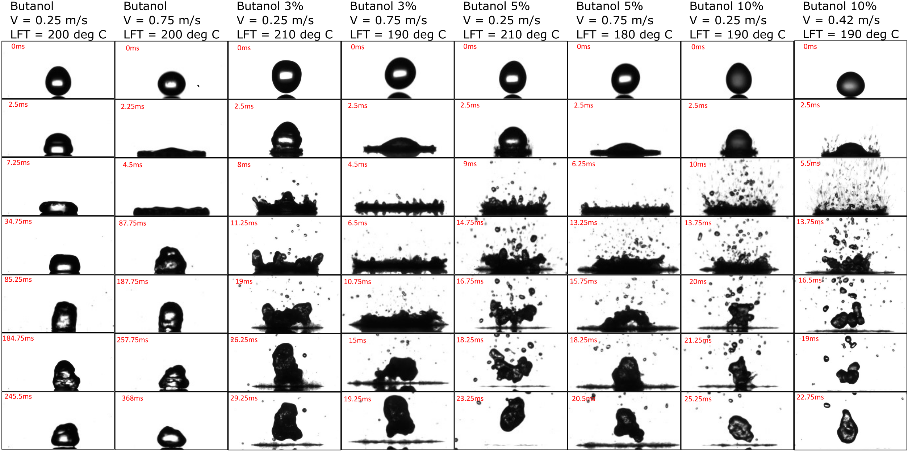

# Experimental Leidenfrost study of impacting droplets of n-butanol - water binary mixtures at different velocities

Pure butanol drop impacting a heated steel plate(210 degC) at 0.25 mps 

Dynamic behaviour of droplets with various impact speeds at their respective  Leidenfrost Points
